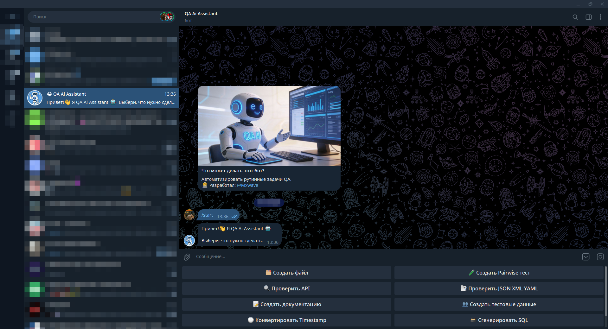
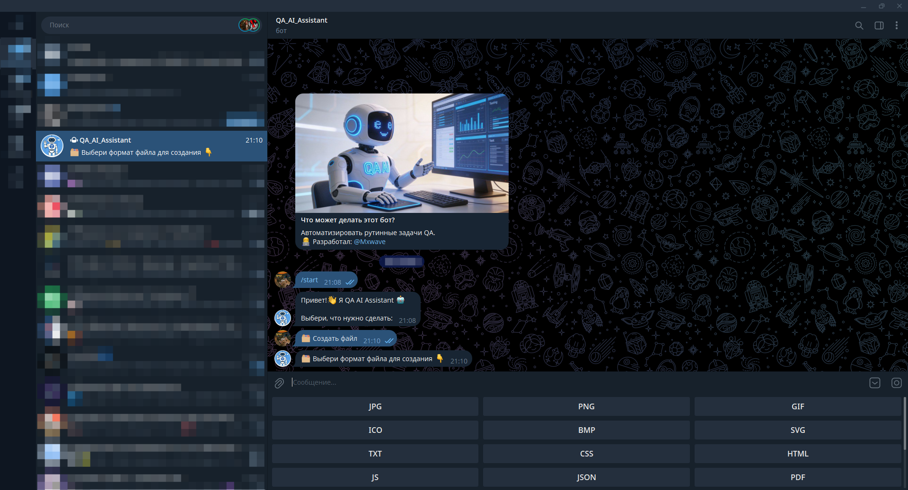

<h1 align="center">🤖 QA Ai AssistantBot</h1>
<h3 align="center">
  Telegram бот для автоматизации рутинных задач QA с поддержкой AI-ассистентов
</h3>

<p align="center">
  
  
  
  
  
</p>

## 🎯 Возможности

* ⚡ Автоматизация рутинных задач тестировщика
* 🤖 Интеграция с AI-ассистентами (OpenAI, Anthropic Claude, DeepSeek)
* 📝 Генерация тестовых данных и документации
* 🛠️ Набор плагинов для различных задач QA

## 📸 Скриншоты

#### Начало работы



#### Создание файла



#### Создание карты


#### Создание тест-кейса


## 🛠 Функционал

| Плагин | Команда | Описание |
|--------|---------|----------|
| Создать файл | `/file` | Создание тестовых файлов различных форматов |
| Создать Pairwise тест | `/pairwise` | Создание оптимальных тестовых комбинаций |
| Проверить API | `/api` | Проверка и валидация API по URL |
| Проверить JSON XML YAML | `/datavalidator` | Проверка и валидация JSON, XML, YAML |
| Создать документацию | `/docs` | Создание документации (тест-кейс, чек-лист, баг-репорт) |
| Создать тестовые данные | `/testdata` | Создание тестовых данных пользователей и банковских карт |
| Конвертировать Timestamp | `/timestamp` | Конвертация Timestamp (секунды/миллисекунды) в дату и время |
| Сгенерировать SQL | `/sql` | Генерация SQL CRUD запросов |

### 🗂 Создать файл
* Создание тестовых файлов (DOCX, XLSX, TXT, PDF, CSS, HTML, JS, JSON, ZIP, RAR, MP4, AVI)
* Поддержка изображений (JPG, PNG, GIF, BMP, SVG, ICO)
* Настройка размеров и параметров

### 🧪 Создать Pairwise тест
* Создание оптимального набора тестовых комбинаций
* Поддержка произвольного количества параметров
* Сокращение количества тестов при сохранении покрытия

### 🔍 Проверить API
* Проверка и валидация API по URL
* Поддержка методов: GET, POST, PUT, DELETE, PATCH, HEAD, OPTIONS
* Обработка ошибок (таймауты, сетевые ошибки, недоступность сервера)

### 📑 Проверить JSON XML YAML
* Проверка корректности синтаксиса
* Проверка форматирования, отступы
* Проверка закрывающих скобок, корректности тегов, структуру данных

### 📝 Создать документацию
* Создание структурированных тест-кейсов, чек-листов, баг-репортов
* Готовые шаблоны с основными полями
* Быстрый старт для создания артефактов тестирования

### 👥 Создать тестовые данные
* Создание профилей тестовых пользователей и банковских карт
* Создание логинов, паролей, email, имен, адресов, телефонов, даты рождения
* Создание валидных тестовых номеров карт (по алгоритму Луна)
* Поддержка систем: Visa, Mastercard, UnionPay, JCB, Mir
* Генерация CVV/CVC и срока действия

### 🕐 Конвертировать Timestamp
* Вывод в нескольких форматах
* Конвертация Timestamp (секунды/миллисекунды) в дату и время
* Автоматическое определение формата (timestamp или дата)

### 🗃 Сгенерировать SQL
* Генерация CRUD: Мгновенное создание шаблонов INSERT, SELECT, UPDATE, DELETE
* Создание структуры таблиц и колонок
* Поддержка условий (WHERE), лимитов и граничных значений

## 🤖 AI-ассистенты

Бот интегрирован с мощными AI-моделями:
* 🧠 **OpenAI GPT** - для сложных аналитических задач
* 💬 **Anthropic Claude** - для детального анализа и генерации текста
* 🚀 **DeepSeek** - быстрые ответы и помощь в тестировании

## 📝 Особенности реализации

* 🏗️ Модульная архитектура с плагинами
* 🔄 Асинхронная обработка запросов
* 📊 Логирование всех событий
* 📱 Интуитивное меню с кнопками
* 🤖 Интеграция с несколькими AI-моделями

## 🛠 Стек технологий

* 🐍 [Python 3.9+](https://www.python.org/) - язык программирования
* 🌐 [aiohttp](https://docs.aiohttp.org/) - асинхронные HTTP запросы
* 📦 [Aiogram](https://docs.aiogram.dev/) - асинхронный фреймворк для Telegram Bot API
* 🧪 [AllPairsPy](https://github.com/thombashi/allpairspy) - комбинаторное тестирование
* 🔐 [python-dotenv](https://pypi.org/project/python-dotenv/) - загрузка переменных окружения из файла `.env`
* 🖼 [Pillow](https://python-pillow.org/) - работа с изображениями
* 🎲 [Faker](https://pypi.org/project/Faker/) - генерация тестовых данных
* 📋 [PyYAML](https://pyyaml.org/), [xmltodict](https://github.com/martinblech/xmltodict), [lxml](https://lxml.de/) - парсинг и обработка YAML, XML, HTML
* 📄 [python-docx](https://python-docx.readthedocs.io/) (`.docx`), [openpyxl](https://openpyxl.readthedocs.io/) (`.xlsx`), [reportlab](https://www.reportlab.com/) (`.pdf`) - экспорт документации
* 🤖 [OpenAI API](https://platform.openai.com/) - интеграция моделей GPT
* 🧠 [Anthropic Claude API](https://www.anthropic.com/) - использование Claude
* 🐋 [DeepSeek API](https://www.deepseek.com/) - работа с моделями DeepSeek

## 🚀 Как запустить проект

1. **Скачайте проект или клонируйте репозиторий**
```bash
git clone https://github.com/MaximMxwave/qa_ai_bot.git
cd qa_ai_bot
```

2. **Создайте Telegram-бота через [@BotFather](https://t.me/BotFather)**

3. **Скопируйте .env.example в .env**

```bash
cp .env.example .env
```

4. **Настройте переменные окружения (.env файл)**
```bash
BOT_TOKEN=ваш_токен_бота
ADMIN_ID=ID_администратора
OPENAI_API_KEY=ваш_ключ_openai
ANTHROPIC_API_KEY=ваш_ключ_anthropic
DEEPSEEK_API_KEY=ваш_ключ_deepseek
```

5. **Установите зависимости**
```bash
pip install -r requirements.txt
```

6. **Выберите AI-модель (по умолчанию gpt-3.5-turbo). Изменить модель можно в файле .env**
```bash
DEFAULT_AI_MODEL=openai # openai, claude, deepseek
```

7. **Запустите бота**
```bash
python main.py
```

## 📁 Структура проекта

```
qa_ai_bot/
├── logs/                       # Директория для логов
├── plugins/                    # Директория с плагинами
│   ├── bug_report_creator.py   # Создание баг-репортов
│   ├── file_generator.py       # Создание файлов
│   ├── json_validator.py       # Проверить JSON
│   ├── pairwise_tester.py      # Создание Pairwise тестов
│   ├── payment_generator.py    # Создание платежных данных
│   ├── test_case_template.py   # Создание тест-кейса
│   └── test_data_generator.py  # Создание тестовых данных
├── ai_service.py               # Сервис для работы с AI-моделями
├── .env                        # Админ и токены
├── config.py                   # Конфигурация
├── handlers.py                 # Обработчики команд
├── main.py                     # Основной файл бота
├── messages.py                 # Текстовые сообщения
└── requirements.txt            # Зависимости
```

### 🔗 Ссылка на бота

[t.me/QA_Ai_AssistantBot](https://t.me/QA_Ai_AssistantBot)

**👨‍💻 Разработал:**

Максим Олесов ([@Mxwave](https://t.me/Mxwave))

<p align="left">
  
</p>
